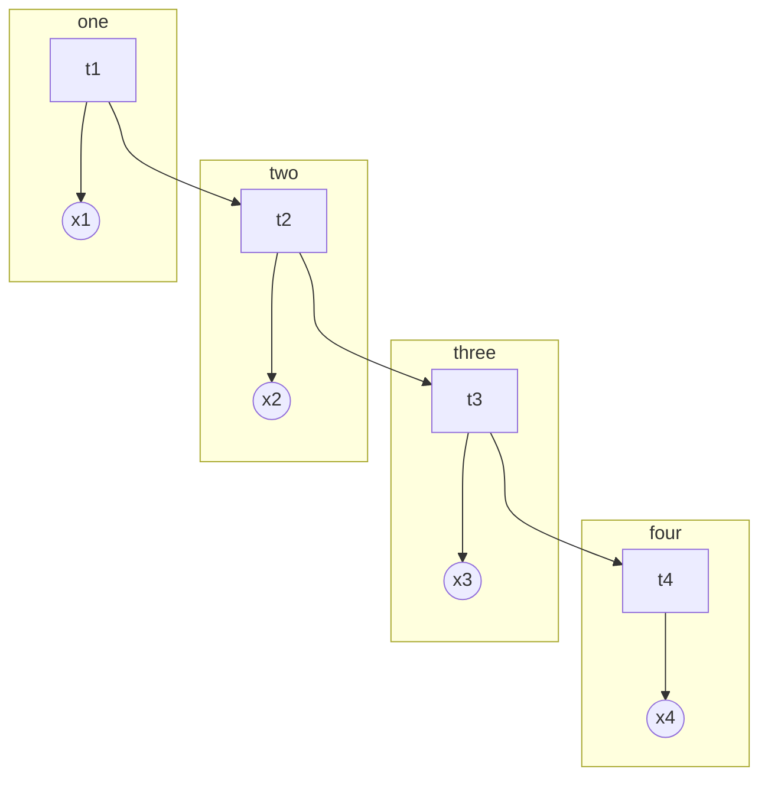

# 基于`HMM`的汉语词性标注

## 一、隐马尔可夫模型

#### 1.1马尔可夫模型

马尔可夫过程（Markov process）是一类随机过程。它的原始模型马尔可夫链，由俄国数学家A.A.马尔可夫于1907年提出。该过程具有如下特性：在已知目前状态（现在）的条件下，它未来的演变（将来）不依赖于它以往的演变 (过去 )。例如森林中动物头数的变化构成——马尔可夫过程。在现实世界中，有很多过程都是马尔可夫过程，如液体中微粒所作的布朗运动、传染病受感染的人数、车站的候车人数等，都可视为马尔可夫过程。

每个状态的转移只依赖于之前的n个状态，这个过程被称为1个n阶的模型，其中n是影响转移状态的数目。最简单的马尔可夫过程就是一阶过程，**每一个状态的转移只依赖于其之前的那一个状态**，这个也叫作**马尔可夫性质**。用数学表达式表示就是下面的样子：
$$
P(X_{n+1}|X_1=x_1,X_2=x_2,…,X_n=x_n)=P(X_{n+1}=x|X_n=x_n)
$$
假设这个模型的每个状态都只依赖于之前的状态，这个假设被称为**马尔科夫假设**，这个假设可以大大的简化这个问题。显然，这个假设可能是一个非常糟糕的假设，导致很多重要的信息都丢失了。

假设天气服从**马尔可夫链**：

[](https://camo.githubusercontent.com/1e693312da9edd51f96e7edea3c43464de3f342f/687474703a2f2f7778342e73696e61696d672e636e2f6d773639302f30303633304465666c79316734793874623878656b6a3330623630327a37346e2e6a7067)

从上面这幅图可以看出：

- 假如今天是晴天，明天变成阴天的概率是0.1
- 假如今天是晴天，明天任然是晴天的概率是0.9，和上一条概率之和为1，这也符合真实生活的情况。

|        | 晴   | 阴   |
| ------ | ---- | ---- |
| **晴** | 0.9  | 0,1  |
| **阴** | 0.5  | 0.5  |

由上表我们可以得到马尔可夫链的**状态转移矩阵**：

[](https://camo.githubusercontent.com/3f4cf2114bb56a7ae5db2b629eb51ff013bc66f6/687474703a2f2f7778332e73696e61696d672e636e2f6d773639302f30303633304465666c793167347939326b326261736a333036693032323073752e6a7067)

因此，一阶马尔可夫过程定义了以下三个部分：

- **状态**：晴天和阴天
- **初始向量**：定义系统在时间为0的时候的状态的概率
- **状态转移矩阵**：每种天气转换的概率

马尔可夫模型（Markov Model）是一种统计模型，广泛应用在语音识别，词性自动标注，音字转换，概率文法等各个自然语言处理等应用领域。经过长期发展，尤其是在语音识别中的成功应用，使它成为一种通用的统计工具。到目前为止，它一直被认为是实现快速精确的语音识别系统的最成功的方法。

#### 1.2隐马尔可夫模型

在某些情况下马尔科夫过程不足以描述我们希望发现的模式。回到之前那个天气的例子，一个隐居的人可能不能直观的观察到天气的情况，但是有一些海藻。民间的传说告诉我们海藻的状态在某种概率上是和天气的情况相关的。在这种情况下我们有两个状态集合，一个可以观察到的状态集合（海藻的状态）和一个隐藏的状态（天气的状况）。我们希望能找到一个算法可以根据海藻的状况和马尔科夫假设来预测天气的状况。

而这个算法就叫做**隐马尔可夫模型**。


隐马尔可夫模型 (Hidden Markov Model) 是一种统计模型，用来描述一个含有隐含未知参数的马尔可夫过程。**它是结构最简单的动态贝叶斯网，这是一种著名的有向图模型**，主要用于时序数据建模，在语音识别、自然语言处理等领域有广泛应用。

##### 1.2.1基本结构

`HMM` 用概率图表示为：



上图表示了四个时刻的隐变量变化。
$$
用参数 \lambda=(\pi,A,B) 来表示，\\其中 \pi 是开始的概率分布\\A 为状态转移矩阵，B 为发射矩阵。\\下面使用 o_t 来表示观测变量，O为观测序列，\\V=\{v_1,v_2,\cdots,v_M\} 表示观测的值域\\i_t 表示状态变量，I 为状态序列，Q=\{q_1,q_2,\cdots,q_N\} 表示状态变量的值域
$$
定义： 
$$
A=(a_{ij}=p(i_{t+1}=q_j|i_t=q_i))
$$
 表示状态转移矩阵，
$$
B=(b_j(k)=p(o_t=v_k|i_t=q_j))
$$
 表示发射矩阵。

在 `HMM` 中，有两个基本假设：

1. 齐次 Markov 假设（未来只依赖于当前）：
   $$
   p(i_{t+1}|i_t,i_{t-1},\cdots,i_1,o_t,o_{t-1},\cdots,o_1)=p(i_{t+1}|i_t)
   $$

2. 观测独立假设：
   $$
   p(o_t|i_t,i_{t-1},\cdots,i_1,o_{t-1},\cdots,o_1)=p(o_t|i_t)
   $$

**`HMM` 要解决三个问题：**

1. **Evaluation**：
   $$
   p(O|\lambda)，Forward-Backward 算法
   $$
   
2. **Learning**：
   $$
   \lambda=\mathop{argmax}\limits_{\lambda}p(O|\lambda)，EM 算法（Baum-Welch）
   $$
   
3. **Decoding**：
   $$
   I=\mathop{argmax}\limits_{I}p(I|O,\lambda)，Vierbi 算法
   $$

##### 1.2.2 Decoding(解码)

因本次词性标注实验中只涉及Decoding问题，故这里只说明针对此问题的`Viterbi`算法

Decoding 问题表述为：
$$
I=\mathop{argmax}\limits_{I}p(I|O,\lambda)
$$
我们需要找到一个序列，其概率最大，这个序列就是在参数空间中的一个路径，可以采用动态规划的思想。

定义：
$$
\delta_{t}(j)=\max\limits_{i_1,\cdots,i_{t-1}}p(o_1,\cdots,o_t,i_1,\cdots,i_{t-1},i_t=q_i)
$$
于是：
$$
\delta_{t+1}(j)=\max\limits_{1\le i\le N}\delta_t(i)a_{ij}b_j(o_{t+1})
$$
这个式子就是从上一步到下一步的概率再求最大值。记这个路径为：
$$
\psi_{t+1}(j)=\mathop{argmax}\limits_{1\le i\le N}\delta_t(i)a_{ij}
$$

## 二、词性标注

在对`HMM`模型有了基础认识之后，便可使用该模型解决具体的问题。以词性标注为例，若要预测句子中每个词（字）对应的词性，也即为`HMM`模型的Decoding（解码）问题；模型**λ=(A,B,π)**已知、观测序列**`O`**为当前的句子，隐藏状态`I`为词对应的词性，求出观测序列条件概率**P（I|O）**最大的状态序列。

#### 2.1参数求解

参数求解有两种方法解决：有监督或者无监督。有监督的参数训练通过标注训练集统计获得相关参数，难度较低；无监督的参数训练则通过鲍姆-韦尔奇算法迭代训练获得，难度很大。此实验为有监督的词性标注，也即HMM参数的训练通过统计语料库获得。（注：学习语料为199801人民日报语料）

1. 初始状态概率向量（**π**）

   定义：在`POS`中定义为每个词性出现在句首的概率

   计算：π[q]= 词性p出现在句子开头的次数 / 句子的总数

   ```python
   # 定义pi为字典，pi [p] = p的初始概率
   pi = defaultdict(int) 
   # 学习初始概率,句子开头词性的频率
   for sentence in train_data：
       pi [sentence [0] [1] ] += 1
   ```

2. 转移概率矩阵**（A）**

   定义：词性`P1`后边紧跟着的每个词性的概率

   计算：`transition [p1] [p2]` 也就是词性`p1`后边是`p2`的概率 `transition [p1] [p2]` = 所有句子中相邻词的二元组，词性`p1`后边是词性`p2`的个数 / 所有句子相邻词的二元组中，第一个词性是`p1`的总数；

   ```python
   # 定义transition为字典。transition = { 词性p1： { 转移到的词性： 对应概率}}
   transition = {}
   for p in pos: # pos为所有的词性
       transition[p] = defaultdict(int)
   # 学习transition
   states_transition = [(p1[1],p2[1]) for p1,p2 in zip(sent,sent[1:])]
   #学习转移概率
   for p1,p2 in states_transition:
       transition [p1][p2] += 1
   ```

3. 发射概率矩阵（**B**）

   定义：指在所有被标注为词性P的词中，词W的概率

   计算：emission [i][w]也就是词性i的情况下是w的概率，P（w | i） emission [p] [w] = 所有句子相邻词的二元组中，词性p的发射词w的个数 / 所有句子相邻词的二元组中，词性p的个数

   ```python
   #定义 同transition。emission = {词性P：{word ： 对应概率}}
   emission = {}
   for p in pos:
       emission [ p] = defaultdict(int)
      # 学习emission
   for word，pos in sentence:
       emission [pos][word] += 1
   ```

#### 2.2预测解码

原理部分上文已经说明，这里用python进行实现

```python
def viterbi(self, obs, states, start_p, trans_p, emit_p):
    """
    :param obs: 可见序列
    :param states: 隐状态
    :param start_p: 开始概率
    :param trans_p: 转换概率
    :param emit_p: 发射概率
    :return: 序列+概率
    """
    path = {}
    V = [{}]  # 记录第几次的概率
    for state in states:
        V[0][state] = start_p[state] * emit_p[state].get(obs[0], 0)
        path[state] = [state]
    for n in range(1, len(obs)):
        V.append({})
        newpath = {}
        for k in states:
            pp, pat = max([(V[n - 1][j] * trans_p[j].get(k, 0) * emit_p[k].get(obs[n], 0), j) for j in states])
            V[n][k] = pp
            newpath[k] = path[pat] + [k]
        path = newpath
    (prob, state) = max([(V[len(obs) - 1][y], y) for y in states])
    return prob, path[state]
```


## 三、参考文献

【1】HMM 实现中文词性标注&Viterbi讲解，地址：https://zhuanlan.zhihu.com/p/62119610

【2】HMM+Vetebi算法实现词性标注 python实现  地址：https://github.com/Hareric/Natural-Language-Processing/tree/master/HMM

【3】《统计自然语言处理》，宗成庆著，P108-P118

【4】机器学习-白板推导系列(十四)-隐马尔可夫模型HMM（Hidden Markov Model）地址：https://www.bilibili.com/video/BV1aE411o7qd?p=82

## 四、代码实现

见文件夹